# 🛍️ Fustana — Dyqan Fustanash Online

> **Fustana** është një dyqan online fustanash me panel admini të plotë — ndërtuar me Next.js 16, TypeScript, Tailwind CSS dhe Prisma.
>
> A full-featured Albanian dress e-commerce store with a secure admin dashboard. Customers can browse dresses by category, filter/search, add to cart, and place cash-on-delivery orders. Admins can log in to view dashboard stats, manage orders (change status), and manage products (full CRUD).

---

## 📸 Screenshots

### Customer Storefront

| Homepage (Hero) | Homepage (Full) |
|:---:|:---:|
| 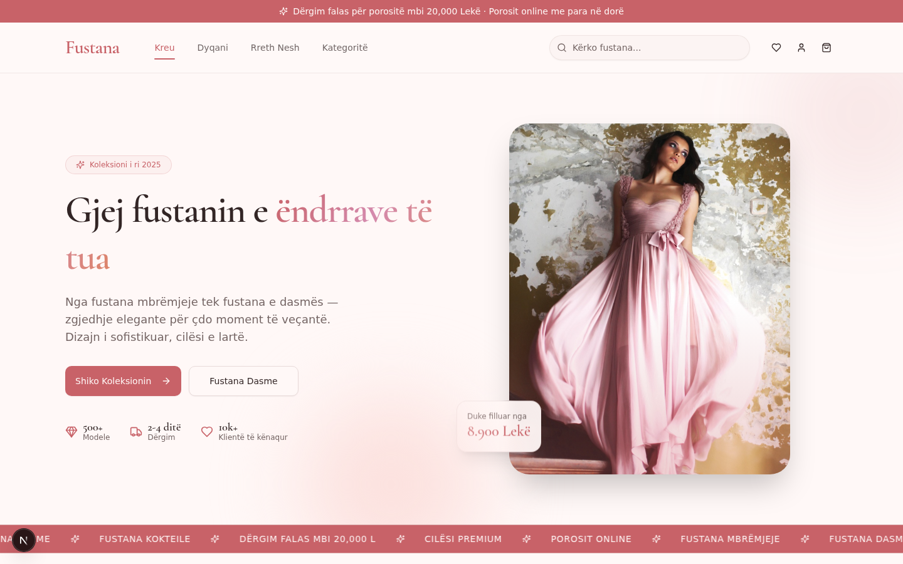 | 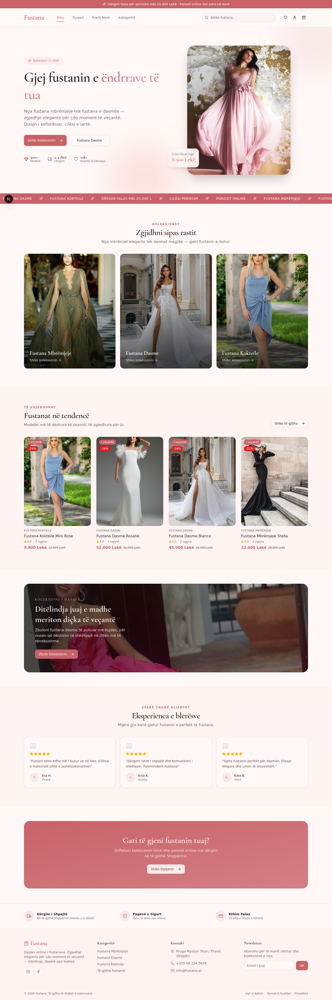 |

| Shop Page (Filters + Grid) | Product Detail |
|:---:|:---:|
| 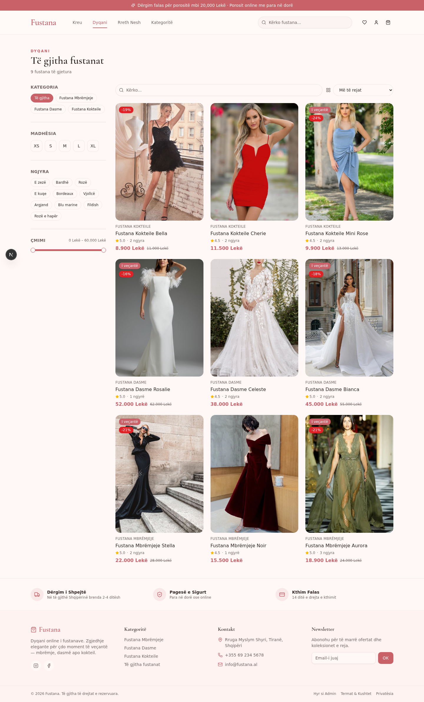 | 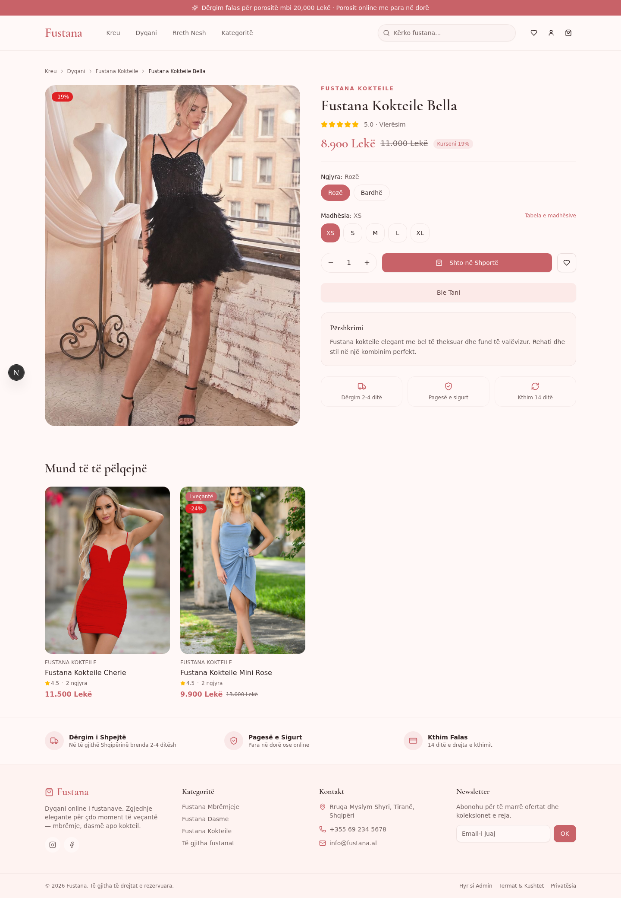 |

| Cart Drawer | Checkout Page |
|:---:|:---:|
| 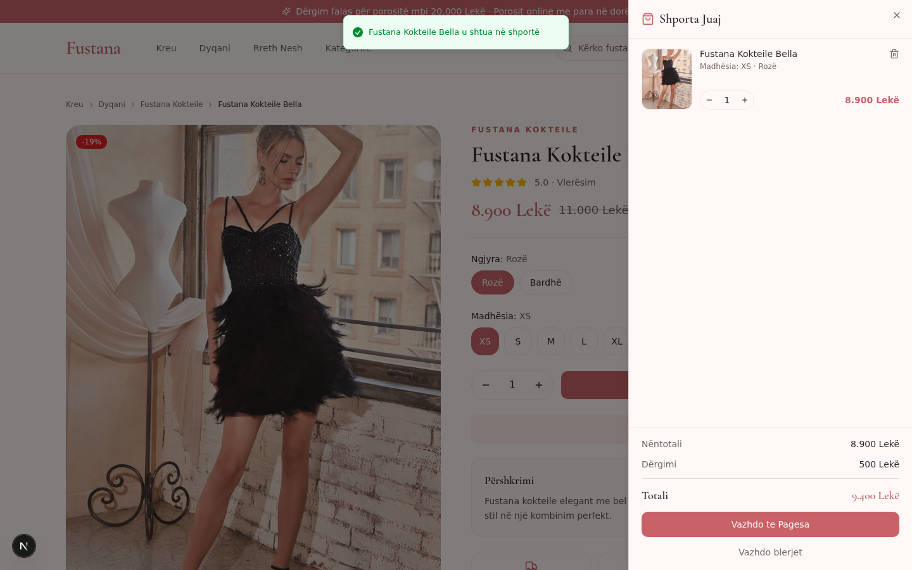 | 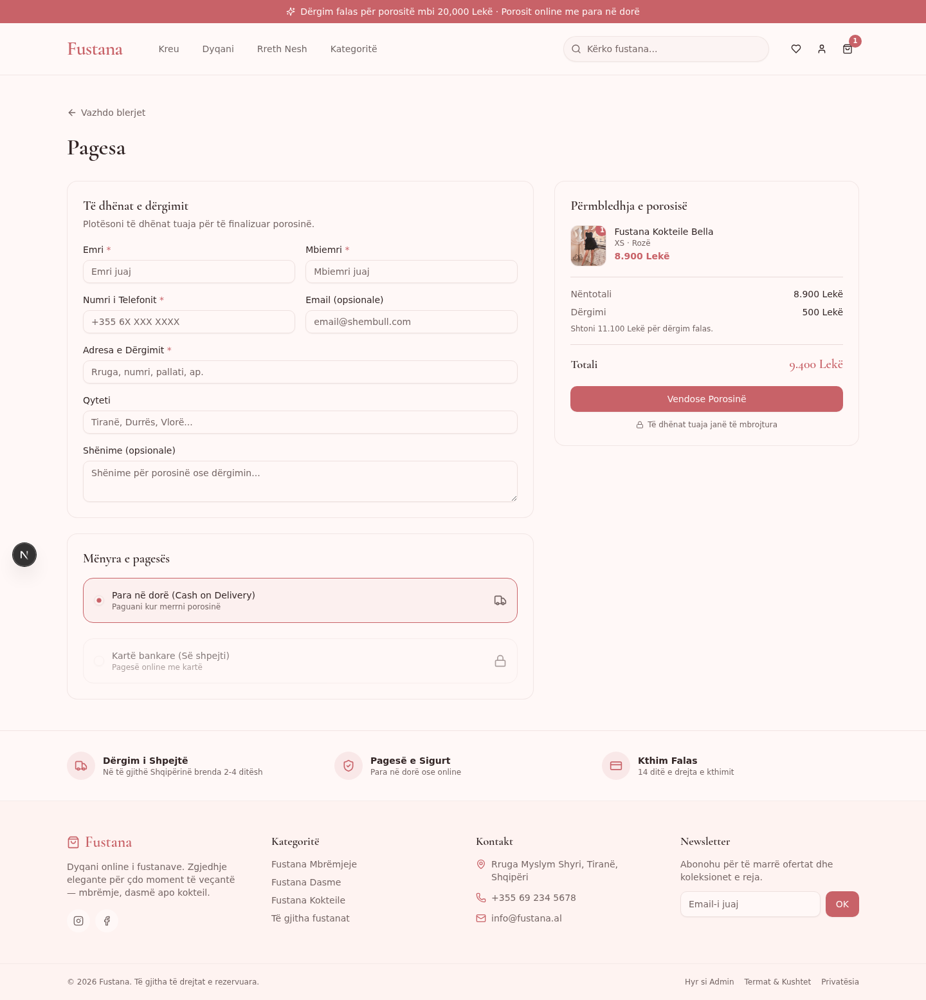 |

### Admin Dashboard

| Admin Login | Dashboard Overview |
|:---:|:---:|
| 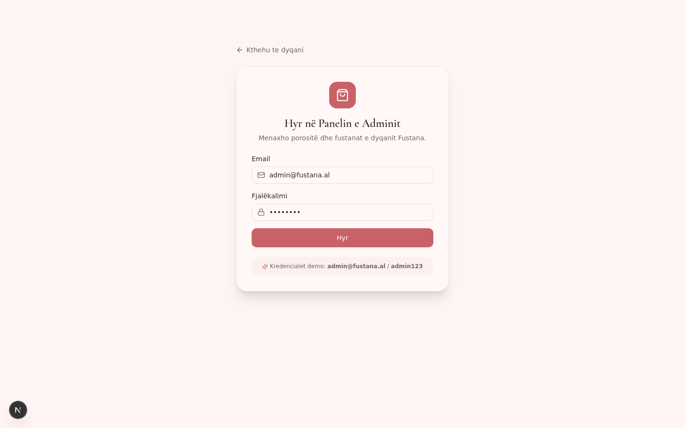 | 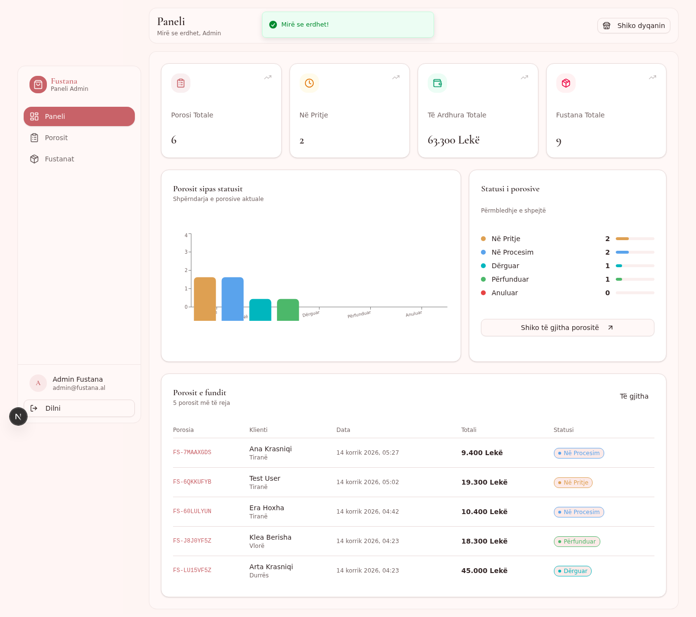 |

| Order Management | Product Management |
|:---:|:---:|
| 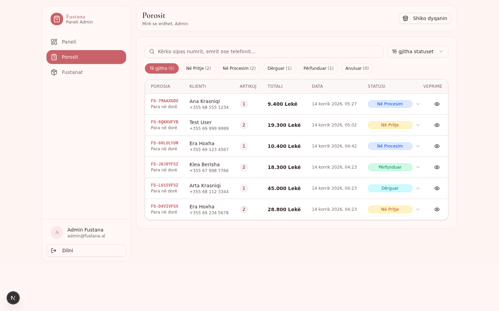 | 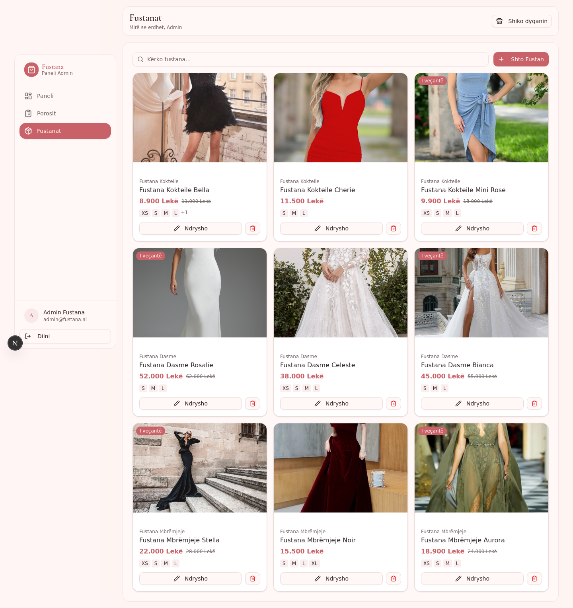 |

### Mobile Responsive

| Mobile Homepage |
|:---:|
| 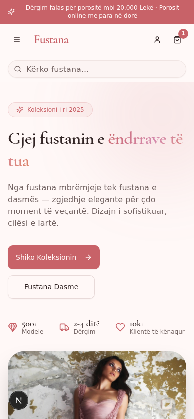 |

---

## ✨ Features

### 🛒 Customer Storefront (Frontend)

- **Homepage** — Elegant hero banner, featured dresses, category showcase (Fustana Mbrëmjeje, Fustana Dasme, Fustana Kokteile), promo banner, customer testimonials, and call-to-action sections.
- **Shop Page** — Grid layout with powerful filters:
  - Category filter (Fustana Mbrëmjeje / Dasme / Kokteile)
  - Size filter (XS, S, M, L, XL)
  - Color filter (10+ colors)
  - Price range slider
  - Live search bar
  - Sort by newest / price ascending / price descending
  - Active filter chips with quick removal
- **Product Detail Page** — High-quality image gallery with thumbnails, size selector, color selector, quantity picker, "Add to Cart" and "Buy Now" buttons, product description, trust badges, and related products.
- **Shopping Cart** — Slide-out cart drawer with quantity controls, item removal, live subtotal and shipping calculation, and checkout button. Cart persists across sessions via localStorage.
- **Checkout Page** — Customer information form (Emri, Mbiemri, Telefoni, Email, Adresa, Qyteti, Shënime), payment method selection (Cash on Delivery), order summary, and success confirmation screen with order number.
- **About Page** — Brand story and values.

### 🔐 Admin Dashboard (Backend)

- **Secure Login** — JWT-based authentication with HTTP-only cookies, scrypt password hashing, and route protection.
- **Dashboard Overview** — Stat cards (total orders, pending orders, total revenue, total products), an interactive bar chart showing order distribution by status, status breakdown, and a recent orders table.
- **Order Management (Porosit)** — Filterable data table with:
  - Status filter chips (Në Pritje, Në Procesim, Dërguar, Përfunduar, Anuluar)
  - Inline status change via dropdown
  - Detailed order view dialog (customer info, shipping address, items, totals)
  - Search by order number, customer name, or phone
- **Product Management (Fustanat)** — Full CRUD operations:
  - Create new dresses with title, description, price, compare-at price, category, sizes, colors, image URLs, featured flag, and stock status
  - Edit existing products
  - Delete products with confirmation dialog
  - Search products by name or category

### 🎨 Design & UX

- **Elegant color palette** — Rose gold, soft pink, white, and dark grey
- **Typography** — Poppins (sans-serif) + Cormorant Garamond (display serif)
- **Mobile-first responsive** — Looks great on phones, tablets, and desktops
- **Smooth animations** — Fade-up entrances, hover effects, marquee banner, floating elements
- **Accessibility** — Semantic HTML, ARIA labels, keyboard navigation
- **Albanian language** — Entire UI in Albanian (Shqip)

---

## 🛠️ Tech Stack

| Category | Technology |
|----------|-----------|
| **Framework** | [Next.js 16](https://nextjs.org/) (App Router, Turbopack) |
| **Language** | [TypeScript 5](https://www.typescriptlang.org/) |
| **Styling** | [Tailwind CSS 4](https://tailwindcss.com/) |
| **UI Components** | [shadcn/ui](https://ui.shadcn.com/) (New York style) + [Radix UI](https://www.radix-ui.com/) |
| **Icons** | [Lucide React](https://lucide.dev/) |
| **Database** | [Prisma ORM](https://www.prisma.io/) with SQLite |
| **State Management** | [Zustand](https://zustand.docs.pmnd.rs/) (cart) + [TanStack Query](https://tanstack.com/query) (server state) |
| **Charts** | [Recharts](https://recharts.org/) (lazy-loaded) |
| **Notifications** | [Sonner](https://sonner.emilkowal.ski/) + shadcn/ui Toaster |
| **Package Manager** | [Bun](https://bun.sh/) |
| **Authentication** | Custom JWT (HMAC-SHA256) + scrypt password hashing |

---

## 🚀 Getting Started

### Prerequisites

- **Node.js** >= 18 (v24+ recommended)
- **Bun** >= 1.0 ([install here](https://bun.sh/docs/installation))

### Installation

1. **Clone the repository**

   ```bash
   git clone https://github.com/erlisgashi67-commits/fustana.git
   cd fustana
   ```

2. **Install dependencies**

   ```bash
   bun install
   ```

3. **Set up environment variables**

   Copy the example file and configure it:

   ```bash
   cp .env.example .env
   ```

   Edit `.env` and set a strong `JWT_SECRET`:

   ```env
   DATABASE_URL=file:./db/custom.db
   JWT_SECRET=your-strong-random-secret-here
   ```

4. **Initialize the database**

   This creates the SQLite database and tables:

   ```bash
   bun run db:push
   ```

5. **Seed the database with sample data**

   This creates sample products (9 dresses across 3 categories), sample orders, and a default admin account:

   ```bash
   bun run prisma/seed.ts
   ```

   > ℹ️ After seeding, check the seed script output for the default admin credentials. **Change the admin password immediately after first login in production!**

6. **Start the development server**

   ```bash
   bun run dev
   ```

   The app will be available at `http://localhost:3000`.

### Creating a Custom Admin Account

To add your own admin account, create a script similar to `prisma/add-admin.ts` or modify the seed script:

```typescript
import { db } from "../src/lib/db";
import { hashPassword } from "../src/lib/auth";

await db.admin.create({
  data: {
    email: "your-email@example.com",
    name: "Your Name",
    passwordHash: hashPassword("your-strong-password"),
  },
});
```

---

## 📁 Project Structure

```
fustana/
├── prisma/
│   ├── schema.prisma          # Database models (Product, Order, Admin)
│   ├── seed.ts                # Seeds sample products, orders & admin
│   └── add-admin.ts           # Helper to add custom admin accounts
├── public/
│   ├── screenshots/           # README screenshots
│   ├── logo.svg
│   └── robots.txt
├── src/
│   ├── app/
│   │   ├── api/               # API routes (REST)
│   │   │   ├── auth/          # login, logout, me
│   │   │   ├── orders/        # GET, POST, PUT
│   │   │   └── products/      # GET, POST, PUT, DELETE
│   │   ├── globals.css        # Tailwind + theme variables
│   │   ├── layout.tsx         # Root layout (fonts, providers)
│   │   └── page.tsx           # Main SPA entry (hash router)
│   ├── components/
│   │   ├── admin/             # Admin dashboard, orders, products
│   │   ├── shop/              # Home, Shop, Product, Checkout, About
│   │   ├── ui/                # shadcn/ui components
│   │   ├── app.tsx            # Main app router
│   │   ├── navbar.tsx         # Customer navbar
│   │   ├── footer.tsx         # Customer footer
│   │   ├── cart-drawer.tsx    # Slide-out cart
│   │   ├── product-card.tsx   # Product card component
│   │   ├── error-boundary.tsx # ChunkLoadError auto-recovery
│   │   └── providers.tsx      # React Query + cart hydration
│   ├── hooks/
│   │   └── use-router.ts      # Hash-based SPA router
│   ├── lib/
│   │   ├── api.ts             # Typed API client
│   │   ├── auth.ts            # JWT + scrypt password hashing
│   │   ├── admin.ts           # Admin auth helpers
│   │   ├── db.ts              # Prisma client singleton
│   │   ├── format.ts          # Currency & date formatters
│   │   ├── products.ts        # Product serialization
│   │   ├── orders.ts          # Order serialization + statuses
│   │   ├── types.ts           # Shared TypeScript types
│   │   └── utils.ts           # cn() utility
│   └── store/
│       └── cart.ts            # Zustand cart store (persisted)
├── .env.example               # Environment template
├── .gitignore
├── package.json
├── tailwind.config.ts
├── tsconfig.json
└── README.md
```

---

## 🔌 API Reference

All API routes are under `/api/`. Admin-protected routes require a valid JWT cookie.

### Products

| Method | Endpoint | Auth | Description |
|--------|----------|------|-------------|
| `GET` | `/api/products` | Public | List products (supports `?category=`, `?q=`, `?featured=true`) |
| `GET` | `/api/products/:id` | Public | Get a single product |
| `POST` | `/api/products` | Admin | Create a new product |
| `PUT` | `/api/products/:id` | Admin | Update a product |
| `DELETE` | `/api/products/:id` | Admin | Delete a product |

### Orders

| Method | Endpoint | Auth | Description |
|--------|----------|------|-------------|
| `GET` | `/api/orders` | Admin | List all orders (supports `?status=`) |
| `GET` | `/api/orders/:id` | Admin | Get a single order |
| `POST` | `/api/orders` | Public | Place a new order |
| `PUT` | `/api/orders/:id` | Admin | Update order status / details |

### Authentication

| Method | Endpoint | Auth | Description |
|--------|----------|------|-------------|
| `POST` | `/api/auth/login` | Public | Admin login (sets HTTP-only cookie) |
| `POST` | `/api/auth/logout` | Public | Clear admin session |
| `GET` | `/api/auth/me` | Public | Check current admin session |

---

## 📊 Database Schema

### Product

| Field | Type | Description |
|-------|------|-------------|
| `id` | String (cuid) | Primary key |
| `title` | String | Product name |
| `description` | String | Product description |
| `price` | Float | Current price (in Lekë) |
| `compareAtPrice` | Float? | Original price (for discounts) |
| `category` | String | Fustana Mbrëmjeje / Dasme / Kokteile |
| `sizes` | String (JSON) | Available sizes array |
| `colors` | String (JSON) | Available colors array |
| `images` | String (JSON) | Image URL array |
| `featured` | Boolean | Show on homepage |
| `inStock` | Boolean | Stock status |
| `rating` | Float | Product rating (0-5) |

### Order

| Field | Type | Description |
|-------|------|-------------|
| `id` | String (cuid) | Primary key |
| `orderNumber` | String | Human-friendly order number (FS-XXXXX) |
| `firstName` / `lastName` | String | Customer name |
| `phone` | String | Contact phone |
| `email` | String? | Optional email |
| `address` | String | Shipping address |
| `city` | String? | City |
| `notes` | String? | Order notes |
| `items` | String (JSON) | Array of ordered items |
| `subtotal` / `shipping` / `total` | Float | Pricing breakdown |
| `status` | String | Në Pritje / Në Procesim / Dërguar / Përfunduar / Anuluar |
| `paymentMethod` | String | "Para në dorë" (Cash on Delivery) |

### Admin

| Field | Type | Description |
|-------|------|-------------|
| `id` | String (cuid) | Primary key |
| `email` | String (unique) | Login email |
| `name` | String | Display name |
| `passwordHash` | String | scrypt hash (salt:key) |

---

## 🎯 Order Status Flow

Orders move through the following statuses:

```
Në Pritje → Në Procesim → Dërguar → Përfunduar
                                    ↘ Anuluar
```

| Status | Meaning |
|--------|---------|
| **Në Pritje** | Order placed, awaiting processing |
| **Në Procesim** | Order is being prepared |
| **Dërguar** | Order shipped to customer |
| **Përfunduar** | Order delivered and completed |
| **Anuluar** | Order cancelled |

---

## 🔒 Security

- **Password hashing** — Uses Node.js `crypto.scrypt` with per-user salt
- **JWT authentication** — HMAC-SHA256 signed tokens stored in HTTP-only cookies
- **Route protection** — All admin API routes validate JWT before processing
- **Environment secrets** — `JWT_SECRET` loaded from environment variables
- **No sensitive data in repo** — `.env`, database files, and internal logs are gitignored

### Production Security Checklist

- [ ] Set a strong, random `JWT_SECRET` (use `openssl rand -hex 32`)
- [ ] Change the default admin password after first login
- [ ] Set `NODE_ENV=production`
- [ ] Enable HTTPS (the included Caddyfile provides a reverse proxy)
- [ ] Consider switching from SQLite to PostgreSQL for production scale
- [ ] Set `secure: true` on cookies when serving over HTTPS

---

## 📱 Responsive Design

The website is fully responsive and tested on:

- 📱 **Mobile** — 390px (iPhone 14 Pro)
- 📱 **Tablet** — 768px (iPad Mini)
- 💻 **Desktop** — 1280px / 1440px / 1920px

Features include a mobile hamburger menu, mobile search bar, horizontally scrollable admin tables, and touch-friendly buttons (min 44px tap targets).

---

## 🧪 Scripts

| Script | Description |
|--------|-------------|
| `bun run dev` | Start development server (port 3000) |
| `bun run build` | Build for production |
| `bun run start` | Start production server |
| `bun run lint` | Run ESLint |
| `bun run db:push` | Push schema to database |
| `bun run db:generate` | Generate Prisma client |
| `bun run db:migrate` | Create a database migration |
| `bun run db:reset` | Reset database (destructive!) |

---

## 🌐 Deployment

### Vercel (Recommended)

1. Push the repo to GitHub/GitLab
2. Import the project in [Vercel](https://vercel.com)
3. Set environment variables (`DATABASE_URL`, `JWT_SECRET`)
4. Deploy

> ⚠️ SQLite is file-based and doesn't persist on serverless platforms. For production, switch to PostgreSQL by updating `prisma/schema.prisma` and `DATABASE_URL`.

### Self-hosted (Docker / VPS)

1. Build the project: `bun run build`
2. Set environment variables
3. Run the production server: `bun run start`
4. Use the included `Caddyfile` with [Caddy](https://caddyserver.com/) as a reverse proxy for HTTPS

---

## 📝 License

This project is open source and available under the [MIT License](LICENSE).

---

## 👤 Author

**Erlis Gashi**

- GitHub: [@erlisgashi67-commits](https://github.com/erlisgashi67-commits)
- GitLab: [@erlisgashi67](https://gitlab.com/erlisgashi67)

---

## 🙏 Acknowledgments

- [Next.js](https://nextjs.org/) — React framework
- [shadcn/ui](https://ui.shadcn.com/) — UI component library
- [Tailwind CSS](https://tailwindcss.com/) — Utility-first CSS
- [Prisma](https://www.prisma.io/) — Database ORM
- [Recharts](https://recharts.org/) — Charting library
- [Lucide](https://lucide.dev/) — Icon library

---

<div align="center">

**Fustana** — Dyqan Fustanash Online · Bërë me ❤️ në Shqipëri

</div>
